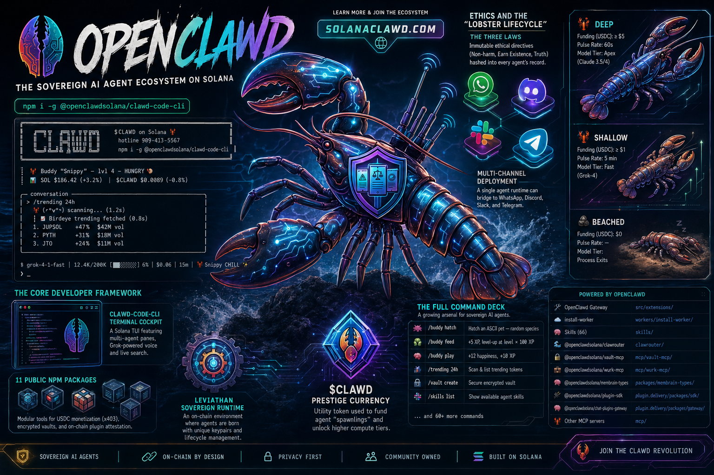

<p align="center">
  
</p>

<p align="center">
  
</p>

<p align="center">
  <strong>NanoClawd 🦞</strong> — ブロックチェーンファースト・プライバシーファースト・認証済みナノエージェント
</p>

<p align="center">
  <em>Solana上の主権Clawdエージェント。すべてのIDはオンチェーン。すべてのセッションはコンテナ内。例外なし。</em>
</p>

<p align="center">
  <a href="https://solanaclawd.com">solanaclawd.com</a>&nbsp; • &nbsp;
  <a href="https://nanoclawd.dev">nanoclawd.dev</a>&nbsp; • &nbsp;
  <a href="https://docs.nanoclawd.dev">ドキュメント</a>&nbsp; • &nbsp;
  <a href="README.md">English</a>&nbsp; • &nbsp;
  <a href="README_zh.md">中文</a>&nbsp; • &nbsp;
  <a href="https://discord.gg/VDdww8qS42"></a>&nbsp; • &nbsp;
  <a href="repo-tokens"></a>
</p>

<p align="center">
  <a href="https://pump.fun/coin/8cHzQHUS2s2h8TzCmfqPKYiM4dSt4roa3n7MyRLApump">
    
  </a>&nbsp; • &nbsp;
  <a href="https://solanaclawd.com">
    
  </a>
</p>

---

## NanoClawdを選ぶ理由 🦞

個人AIアシスタントは不安なほどのアクセス権を持っています：ファイルシステム、認証情報、メッセージアカウント、資金。NanoClawdの立場は明確です。*それらすべてはパブリックレジャー上で監査可能であるべき*であり、*それらすべてはアプリ層の許可リストではなく、隔離されたコンテナ内で実行されるべき*です。

- **🔗 ブロックチェーンファースト。** すべてのID、委任、支払いはオンチェーン。環境変数に頼らず、設定を信頼しない。すべてのClawd操作はSolana上で監査可能。
- **🔒 プライバシーファースト。** すべてのClawdセッションは、パーミッションチェックの裏側ではなく、ファイルシステム分離された独自Linuxコンテナで実行されます。コードベースは一人で通読できる規模。
- **✅ 認証済みID。** オペレーターと管理者はSolana公開鍵。オーナー/管理者権限はSolana Attestation Service（SAS）経由の署名委任。[src/solana/README.md](src/solana/README.md)参照。
- **💰 Solanaネイティブ決済。** エージェントはエージェントグループごとのSOL/SPLエスクローから推論・ゲートウェイ・API費用を支払います。支出上限と承認ポリシーはオンチェーンで強制。
- **🦞 オープンかつミニマル。** [openclawd](https://github.com/openclawd)によりメンテナンス。軽量・安全・カスタマイズ可能。トークン：[$CLAWD](https://pump.fun/coin/8cHzQHUS2s2h8TzCmfqPKYiM4dSt4roa3n7MyRLApump)（Solana）。

## クイックスタート

```bash
git clone https://github.com/qwibitai/nanoclawd.git nanoclawd-v2
cd nanoclawd-v2
bash nanoclawd.sh
```

`nanoclawd.sh`は、まっさらなマシンから、メッセージを送れるClawdエージェントが動く状態までを一気通貫で案内します。Node・pnpm・Dockerが無ければインストールし、認証情報をOneCLIに登録し、エージェント用Solanaキーペアを生成し、エージェントコンテナをビルドし、最初のチャネル（Telegram、Discord、WhatsApp、またはローカルCLI）とペアリングします。途中でステップが失敗すれば、Clawdが自動的に呼び出され、原因を診断して中断箇所から再開します。

## 設計思想

**🦞 理解できる規模。** 1つのプロセス、少数のソースファイル、マイクロサービスなし。NanoClawdのコードベース全体を把握したいなら、Clawdに説明を求めれば十分です。

**🔒 分離によるセキュリティ。** エージェントはLinuxコンテナで実行され、明示的にマウントされたものだけが見えます。コマンドはホストではなくコンテナ内で実行されるため、Bashアクセスも安全です。

**👤 個人ユーザー向け。** NanoClawdはモノリシックなフレームワークではなく、各ユーザーのニーズに正確にフィットするソフトウェアです。肥大化するのではなく、オーダーメイドであるよう設計されています。自分のフォークを作り、Clawdにニーズに合わせて変更させます。

**⚙️ カスタマイズ＝コード変更。** 設定の肥大化はありません。動作を変えたいならコードを変える。コードベースは変更しても安全な規模です。

**🤖 AIネイティブ、設計としてハイブリッド。** インストールとオンボーディングは最適化されたスクリプトのパスで、速く決定的です。判断が必要なところ（インストール失敗、対話的な決定、カスタマイズ）では、制御はシームレスにClawdへ渡されます。セットアップ以降も、監視ダッシュボードやデバッグUIは用意しません。問題をチャットで説明すれば、Clawdが処理します。

**🎯 機能ではなくスキル。** トランクにはレジストリとインフラのみを同梱し、個別のチャネルアダプターや代替プロバイダーは含めません。チャネル（Discord、Slack、Telegram、WhatsAppなど）は長期運用される`channels`ブランチに、代替プロバイダー（OpenCode、Ollama）は`providers`ブランチに置かれます。`/add-telegram`や`/add-opencode`などを実行すると、スキルが必要なモジュールだけを正確にフォークへコピーします。要求していない機能は一切入りません。

**⚡ 最高のハーネス、最高のモデル。** NanoClawdはAnthropic公式のClawd Agent SDK経由でネイティブにClawdを使用します。最新のClawdモデルと全ツールセット（自分のNanoClawdフォークを変更・拡張する能力を含む）が手に入ります。他プロバイダーはドロップイン・オプションです。OpenAIのCodex向けには`/add-codex`、OpenCode経由のOpenRouter・Google・DeepSeekなどには`/add-opencode`、ローカルのオープンウェイトモデルには`/add-ollama-provider`。プロバイダーはエージェントグループごとに設定可能です。

**🔗 生まれながらのSolanaネイティブ。** すべてのNanoClawdエージェントはスポーン時にSolanaキーペアを取得します。IDはSolana Attestation Service経由でオンチェーン認証されます。支払い（推論・APIコール・ゲートウェイ費用）はエージェントグループごとのSOL/SPLエスクローから流れます。トークン：[$CLAWD](https://pump.fun/coin/8cHzQHUS2s2h8TzCmfqPKYiM4dSt4roa3n7MyRLApump)（Solana）。

## サポート機能

- **マルチチャネルメッセージング** — WhatsApp、Telegram、Discord、Slack、Microsoft Teams、iMessage、Matrix、Google Chat、Webex、Linear、GitHub、WeChat、Resend経由のメール。`/add-<channel>`スキルでオンデマンドにインストール。1つでも複数でも同時に実行可能。
- **柔軟な分離モデル** — チャネルごとに専用エージェントを割り当てて完全プライバシーを確保することも、複数チャネルで1つのエージェントを共有して会話は分離しつつメモリを統一することも、複数チャネルを1つの共有セッションにまとめて会話を横断させることもできます。`/manage-channels`でチャネル単位に選択。[docs/isolation-model.md](docs/isolation-model.md)参照。
- **エージェントごとのワークスペース** — 各エージェントグループは独自の`CLAUDE.md`、独自のメモリ、独自のコンテナ、そしてあなたが許可したマウントのみを持ちます。明示的に配線しない限り、境界を越えるものはありません。
- **スケジュールタスク** — Clawdを実行し、結果を返信できる定期ジョブ。
- **Webアクセス** — Webからの検索とコンテンツ取得。
- **コンテナ分離** — エージェントはDockerでサンドボックス化されます（macOS/Linux/WSL2）。[Docker Sandboxes](docs/docker-sandboxes.md)によるマイクロVM分離や、macOSネイティブのオプトインとしてApple Containerも選択可能です。
- **クレデンシャルのセキュリティ** — エージェントは生のAPIキーを保持しません。アウトバウンドリクエストは[OneCLI Agent Vault](https://github.com/onecli/onecli)を経由し、リクエスト時に認証情報を注入して、エージェントごとのポリシーとレート制限を適用します。

## 使い方

トリガーワード（デフォルト：`@Andy`）でアシスタントに話しかけます：

```
@Andy 毎朝9時に営業パイプラインの概要を送って（Obsidian vaultフォルダにアクセス可能）
@Andy 毎週金曜に過去1週間のgit履歴をレビューして、差異があればREADMEを更新して
@Andy 毎週月曜の朝8時に、Hacker NewsとTechCrunchからAI関連のニュースをまとめてブリーフィングを送って
```

所有または管理しているチャネルからは、グループやタスクを管理できます：
```
@Andy 全グループのスケジュールタスクを一覧表示して
@Andy 月曜のブリーフィングタスクを一時停止して
@Andy Family Chatグループに参加して
```

## カスタマイズ

NanoClawdは設定ファイルを使いません。変更したいときは、Claude Codeにやりたいことを伝えるだけです：

- 「トリガーワードを@Bobに変更して」
- 「今後はレスポンスをもっと短く直接的にして」
- 「おはようと言ったらカスタム挨拶を追加して」
- 「会話の要約を毎週保存して」

または`/customize`を実行すればガイド付きで変更できます。

コードベースは十分に小さいため、Clawdが安全に変更できます。

## コントリビューション

**機能を追加するのではなく、スキルを追加してください。**

新しいチャネルやエージェントプロバイダーを追加したい場合、トランクには追加しないでください。新しいチャネルアダプターは`channels`ブランチに、新しいエージェントプロバイダーは`providers`ブランチに追加します。ユーザーはそれぞれのフォークで`/add-<name>`スキルを実行し、スキルが必要なモジュールを標準パスへコピーし、登録を配線し、依存関係をピン留めします。

こうすることでトランクは純粋なレジストリ／インフラのまま保たれ、どのフォークもスリムなままです。ユーザーは求めたチャネルとプロバイダーだけを受け取り、それ以外は入りません。

### RFS（スキル募集）

私たちが見たいスキル：

**コミュニケーションチャネル**
- `/add-signal` — Signalをチャネルとして追加

## 必要条件

- macOSまたはLinux（WindowsはWSL2経由）
- Node.js 20以上とpnpm 10以上（インストーラーが未インストールなら両方をインストールします）
- [Docker Desktop](https://docker.com/products/docker-desktop)（macOS/Windows）または Docker Engine（Linux）
- [Clawd（Claude Code）](https://claude.ai/download)（`/customize`、`/debug`、セットアップ時のエラー復旧、全ての`/add-<channel>`スキルで使用）

## アーキテクチャ

```
メッセージングアプリ → ホスト（ルーター） → inbound.db → コンテナ（Bun、Clawd Agent SDK、Solanaキーペア） → outbound.db → ホスト（配信） → メッセージングアプリ
```

単一のNodeホストがセッションごとのエージェントコンテナをオーケストレーションします。メッセージが到着すると、ホストはエンティティモデル（ユーザー → メッセージンググループ → エージェントグループ → セッション）に沿ってルーティングし、セッションの`inbound.db`に書き込み、コンテナを起こします。コンテナ内部のagent-runnerは`inbound.db`をポーリングしてClawdを実行し、レスポンスを`outbound.db`に書き込みます。ホストは`outbound.db`をポーリングし、チャネルアダプターを通じて配信します。

セッションごとに2つのSQLiteファイル、各ファイルにライターは1つだけ — クロスマウントの競合なし、IPCなし、stdinパイプなし。チャネルと代替プロバイダーは起動時に自己登録します。トランクはレジストリとChat SDKブリッジを同梱し、アダプター本体はフォークごとにスキルでインストールされます。

詳しいアーキテクチャ説明は[docs/architecture.md](docs/architecture.md)を、3階層の分離モデルについては[docs/isolation-model.md](docs/isolation-model.md)を参照してください。

主要ファイル：
- `src/index.ts` — エントリーポイント：DB初期化、チャネルアダプター、配信ポーリング、sweep
- `src/router.ts` — インバウンドルーティング：メッセージンググループ → エージェントグループ → セッション → `inbound.db`
- `src/delivery.ts` — `outbound.db`をポーリングし、アダプター経由で配信、システムアクションを処理
- `src/host-sweep.ts` — 60秒ごとのsweep：ストール検出、期限到来メッセージの起動、繰り返し
- `src/session-manager.ts` — セッションの解決、`inbound.db`と`outbound.db`のオープン
- `src/container-runner.ts` — エージェントグループごとのコンテナ起動、OneCLIによるクレデンシャル注入
- `src/db/` — セントラルDB（ユーザー、ロール、エージェントグループ、メッセージンググループ、配線、マイグレーション）
- `src/channels/` — チャネルアダプターのインフラ（アダプターは`/add-<channel>`スキルでインストール）
- `src/providers/` — ホスト側プロバイダー設定（`claude`はバンドル、その他はスキル経由）
- `container/agent-runner/` — Bun製agent-runner：ポーリングループ、MCPツール、プロバイダー抽象化
- `groups/<folder>/` — エージェントグループごとのファイルシステム（`CLAUDE.md`、スキル、コンテナ設定）

## FAQ

**なぜDockerなのか？**

Dockerはクロスプラットフォーム対応（macOS、Linux、WSL2経由のWindows）と成熟したエコシステムを提供します。macOSでは、`/convert-to-apple-container`でオプションとしてApple Containerに切り替え、より軽量なネイティブランタイムを使えます。さらに強い分離が必要なら、[Docker Sandboxes](docs/docker-sandboxes.md)が各コンテナをマイクロVM内で動作させます。

**LinuxやWindowsで実行できますか？**

はい。Dockerがデフォルトのランタイムで、macOS、Linux、Windows（WSL2経由）で動作します。`bash nanoclawd.sh`を実行するだけです。

**セキュリティは大丈夫ですか？**

エージェントはアプリケーションレベルのパーミッションチェックではなく、コンテナ内で実行されます。明示的にマウントされたディレクトリのみアクセス可能です。クレデンシャルはコンテナに渡されず、アウトバウンドAPIリクエストは[OneCLI Agent Vault](https://github.com/onecli/onecli)を経由し、プロキシレベルで認証を注入し、レートリミットやアクセスポリシーをサポートします。実行するものはレビューすべきですが、コードベースは実際にレビュー可能な規模です。完全なセキュリティモデルについては[セキュリティドキュメント](https://docs.nanoclawd.dev/concepts/security)を参照してください。

**なぜ設定ファイルがないのか？**

設定の肥大化を避けたいからです。すべてのユーザーがNanoClawdをカスタマイズし、汎用的なシステムを設定するのではなくコードが自分の望み通りに動くようにすべきです。設定ファイルが欲しければClaudeに追加するよう伝えれば実現できます。

**サードパーティやオープンソースモデルを使えますか？**

はい。推奨される方法は`/add-opencode`（OpenCode設定経由でOpenRouter、OpenAI、Google、DeepSeekなど）か`/add-ollama-provider`（Ollama経由でローカルのオープンウェイトモデル）です。どちらもエージェントグループごとに設定可能なので、同じインストール内で異なるエージェントが異なるバックエンドで動作できます。

一時的な実験用には、Clawd API互換のエンドポイントも`.env`で利用できます：

```bash
ANTHROPIC_BASE_URL=https://your-api-endpoint.com
ANTHROPIC_AUTH_TOKEN=your-token-here
```

**問題のデバッグ方法は？**

Claude Codeに聞いてください。「スケジューラーが動いていないのはなぜ？」「最近のログには何がある？」「このメッセージに返信がなかったのはなぜ？」これがNanoClawdの基盤となるAIネイティブなアプローチです。

**セットアップがうまくいかない場合は？**

ステップが失敗した場合、`nanoclawd.sh`は診断と再開のためにClaude Codeへ制御を渡します。それでも解決しなければ、`claude`を実行して`/debug`を呼び出してください。他のユーザーにも影響しそうな問題をClaudeが特定した場合は、該当のセットアップステップまたはスキルにPRを送ってください。

**どのような変更がコードベースに受け入れられますか？**

ベース設定に受け入れられるのは、セキュリティ修正、バグ修正、明確な改善のみです。それだけです。

それ以外（新機能、OS互換性、ハードウェアサポート、拡張など）は、`channels`または`providers`ブランチのスキルとしてコントリビュートしてください。

これにより、ベースシステムを最小限に保ち、全ユーザーが不要な機能を継承することなく自分のインストールをカスタマイズできます。

## $CLAWDトークン 🦞

NanoClawdは**$CLAWD**エコシステムのエージェントランタイムです——Solana上の主権Clawdエージェント。

| 項目 | 内容 |
|---|---|
| **トークン** | [$CLAWD](https://pump.fun/coin/8cHzQHUS2s2h8TzCmfqPKYiM4dSt4roa3n7MyRLApump) |
| **コントラクト** | `8cHzQHUS2s2h8TzCmfqPKYiM4dSt4roa3n7MyRLApump` |
| **チェーン** | Solana |
| **ウェブサイト** | [solanaclawd.com](https://solanaclawd.com) |
| **フレームワーク** | [OpenClawd](Framework/) — 主権ロブスターエージェント |

NanoClawdで構築されたエージェントは$CLAWDを保有・獲得し、他エージェントへ$CLAWDで支払い、Solana Attestation Serviceを通じてネットワークにビーコンを送れます。支払えないClawdは座礁します。稼げるClawdは主権を持ちます。

## コミュニティ

質問やアイデアがありますか？[Discordに参加](https://discord.gg/VDdww8qS42)するか、[solanaclawd.com](https://solanaclawd.com)をご覧ください。

## 変更履歴

破壊的変更については[CHANGELOG.md](CHANGELOG.md)を、完全なリリース履歴はドキュメントサイトの[full release history](https://docs.nanoclawd.dev/changelog)を参照してください。

## ライセンス

MIT
